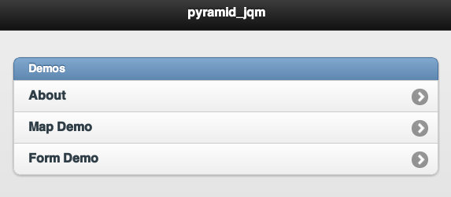

pyramid_jqm
===========

Overview
--------

:mod:`pyramid_jqm` is a package which provides "starter" scaffolding for
creating a :term:`jQuery Mobile` :term:`Pyramid` application.

Installation
------------

Obtain the source code from the git repository:

.. code-block:: text

  $ git clone git://github.com/Pylons/pyramid_jqm.git

Use the "setup.py develop" command of your Python interpreter (or better yet,
a virtualenv) to install the software:

.. code-block:: text

  $ cd pyramid_jqm
  $ /path/to/python setup.py develop

Generating a Sample Application
-------------------------------

The primary job of :mod:`pyramid_jqm` is to provide a :term:`scaffold` which
allows you to easily generate a :term:`Pyramid` application that has jQuery
Mobile integration.  After :mod:`pyramid_jqm` is installed, generate an
application.  The way this is done differs slightly if you're using Pyramid
1.1, 1.2, or 1.3.

On Pyramid 1.1 or 1.2:

.. code-block:: text

   $ $myvenv/bin/paster create -t pyramid_jqm_starter MyApp

On Pyramid 1.3:

.. code-block:: text

   $ $myvenv/bin/pcreate -s pyramid_jqm_starter MyApp

This will create a ``MyApp`` :term:`distribution`, in which will live a
``myapp`` Python :term:`package`.  The distribution represents a
redistributable Pyramid application.  The code which drives the application
lives within the package.  You need to install that package as well:

.. code-block:: text

  $ cd myapp
  $ /path/to/python setup.py develop

The Generated Application
-------------------------

To run the generated application, use ``paster serve`` against the
``development.ini`` file that lives within the distribution directory

.. code-block:: text

   $ paster serve MyApp/development.ini

.. note::

   If you get an exception while doing the above that relates to not being
   able to find a "server runner" for ``egg:pyramid#wsgiref``, upgrade to
   Pyramid 1.0.2, 1.1.3, 1.2.5, or 1.3a2+ or any later release in any of
   those minor versions.

A server will be listening on port 6543.  When you visit it, you will see
something like the following image:

The generated application is optimized for mobile devices, but is usable via
a normal web browser too.  It contains a variety of demonstration
applications.  You can use it as a template to change and being building your
own Pyramid/jQuery Mobile application.

The available demonstration patterns in the application are as follows:

The "About" Page
~~~~~~~~~~~~~~~~

This page displays some text with links in the JQM content area.  It also
fills some dynamic divs with version information using an AJAX request to the
Pyramid server.

See the ``index.html`` source for the ``div`` with the id ``about`` to see
the HTML.  See the ``pyramid.js`` source ``about_pageshow`` function to see
how the version data is retrieved and populated into the DOM.

The "Map Demo" Page
~~~~~~~~~~~~~~~~~~~

This page displays a single Google Map centered on the device location.

See the ``index.html`` source for the ``div`` with the id ``map`` to see the
HTML.  See the ``pyramid.js`` source ``map_pageshow`` and ``map_pagecreate``
functions to see how the map data is retrieved and shown on the page.

The "Form Demo" Page
~~~~~~~~~~~~~~~~~~~~

This page displays a form.  The form is submittable, and the changes made to
the form data persist on the server for the duration of the Pyramid process.
It uses a JSON query to the Pyramid server at page show time to retrieve the
form data.  It uses a separate JSON query (a POST) to send data to the server
when the form submit button is pressed.

See the ``index.html`` source for the ``div`` with the id ``form`` to see the
HTML.  See the ``pyramid.js`` source ``form_pagecreate`` and
``form_pageshow`` functions to see how the form data is retrieved and
changed.

The "Dynamic Pages Demo" Page
~~~~~~~~~~~~~~~~~~~~~~~~~~~~~

This page displays a dynamically-generated list of languages, using the
same data used to generate the "frameworks" multi-select in the form demo.
Each list item links to a URL of a page generated via a server-side view:
when clicked, the ``jquery.mobile`` AJAX link support is triggered, which
causes any page not already loaded to be fetched and then added to the DOM
of the application.

See the ``index.html`` source for the ``div`` with the id ``dynpages`` to see
the HTML for the list of langages.  See the ``pyramid.js`` source
``dynpages_pagecreate``  to see how the JSON data is used to generate the
dynamic links.

XHR Error Handling
~~~~~~~~~~~~~~~~~~

Each XHR query used by the application uses the same generic error handler
(``jqxhr_error``).  This error handler tries to figure out whether the
request failed due to the device being offline, the server being down, or the
server returning an error.  It uses the ``jquery.toastmessage`` library to
notify the user about failures.

Deferreds
~~~~~~~~~

The demo application makes use of jQuery "deferred" objects to form a
callchain.  Each deferred object is resolved at a particular time, permitting
the functions which depend on it to execute successfully.  Deferreds are
resolved via a ``.resolve`` call to the deferred.  Functions use the
``.done`` method of a deferred to wait until the deferred is resolved to
obtain required data.

No Remote Dependencies
~~~~~~~~~~~~~~~~~~~~~~

Often JQM web apps are packaged in a :term:`PhoneGap` (or similar)
native-application wrapper.  When an app is packaged this way, it must be
able to start without having any Internet connectivity.  This means that
scripts cannot rely on Javascript, CSS, or image data loaded from a remote
URL.  The demo application is meant to service these requirements when turned
into a "native" application via PhoneGap or other wrappers.  It ships all
necessary requirements including jQuery, jQuery Mobile, etc.  It's careful to
use the Google Maps "async" method of intializing the Google Maps API instead
of simply relying on a ``<script>`` tag that points at the API.

Server-Side Views
~~~~~~~~~~~~~~~~~

Each server-side Pyramid view uses a JSON renderer, and each is configured
with caching parameters that will prevent the mobile application from
attempting to retrieve data needlessly.  See the ``views.py`` file in the
generated package to see how it works.

More Information
----------------

.. toctree::
   :maxdepth: 1

   glossary.rst

Reporting Bugs / Development Versions
-------------------------------------

Visit http://github.com/Pylons/pyramid_jqm to download development or
tagged versions.

Visit http://github.com/Pylons/pyramid_jqm/issues to report bugs.

Indices and tables
------------------

* :ref:`glossary`
* :ref:`genindex`
* :ref:`modindex`
* :ref:`search`
